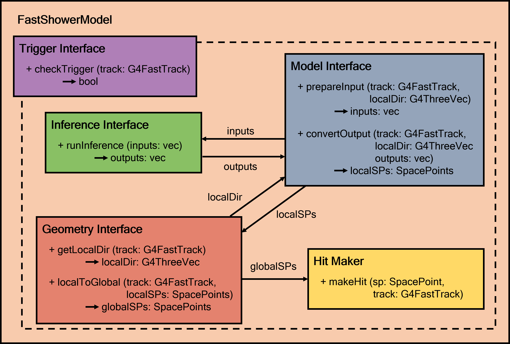
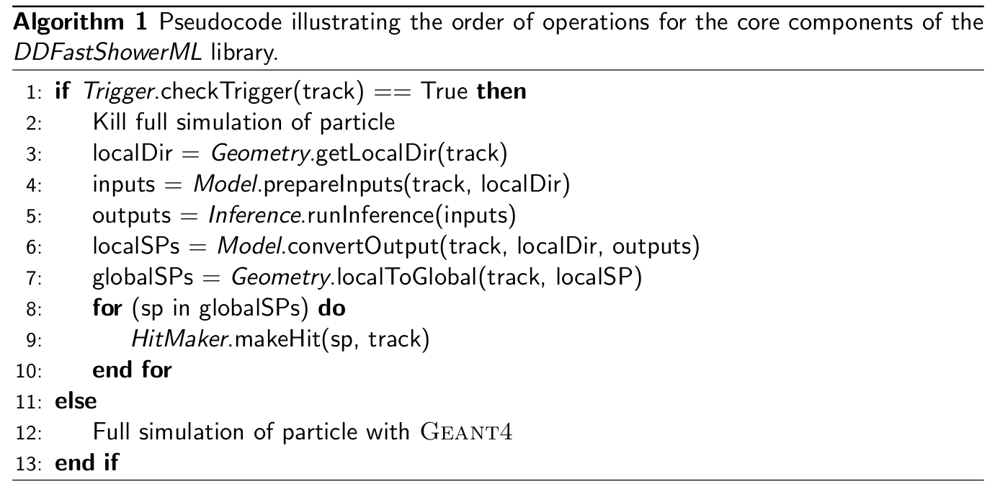

# DDFastShowerML

Library with utilities and plugins that allow running fast simulation in a Geant4 application using ML inference from within ddsim (DDG4).

### References
1. *Fast Simulation of Highly Granular Calorimeters with
Generative Models: Towards a First Physics Application*, P. McKeown et al., PoS EPS-HEP202 3 (2024) 568, DOI: [10.22323/1.449.0568](https://pos.sissa.it/449/568)

2. *Development and Performance of a Fast Simulation Tool for Showers in High Granularity Calorimeters based on Deep Generative Models*, P.McKeown, DESY-THESIS 186 pp. (2024), DOI: [10.3204/PUBDB-2024-01825](https://bib-pubdb1.desy.de/record/607309)


## Quick start guide

### Environment Setup
Access to `cvmfs` required.

The library can be run in apptainer with an Ubuntu 22.04 docker image as follows, with bind mounting to `cvmfs`:
```
mkdir cvmfs
export APPTAINER_CACHEDIR=<path_to_your_cachedir>
export APPTAINER_TMPDIR=<path_to_your_tmpdir>
apptainer shell --bind /cvmfs:/cvmfs docker://ghcr.io/key4hep/key4hep-images/ubuntu22:latest
```

### Installation

Prerequisites:
- a key4hep release. This will provide:
	- DD4hep, Geant4, podio, EDM4hep, LCIO, ...
- ONNXRuntime
- libTorch.so/dylib

This setup can be achieved with the setup script provided:

```
source setup_env_nightly.sh
```

Now build as usual

```
mkdir build
cd build
cmake ..
make -j4 install
```

and ensure to set up the library correctly

```
source ../install/bin/thisDDML.sh
```

### Running the example

The simulation can then be run as usual with ddsim- for example for the ILD detector:

```
cd ../scripts
ddsim --steeringFile ddsim_steer.py --compactFile $k4geo_DIR/ILD/compact/ILD_l5_o1_v02/ILD_l5_o1_v02.xml
```

Depending on the setup in `ddsim_steer.py`, either a `.slcio` file or a `.edm4hep.root` file can be written

Events can be visualised in the standard way for `.slcio` file or a `.edm4hep.root` files, e.g for `.slcio` with ILD:

```
ced2go -d $k4geo_DIR/ILD/compact/ILD_l5_o1_v02/ILD_l5_o1_v02.xml dummyOutput.slcio
```

## Structure of the Library

The library has the following key components:

- **Trigger**: Kill the full simulation and run the fast simulation, if conditions are fulfilled
- **Model**: Prepare the model input, and interpret the output
- **Geometry**: Place spacepoints produced by the model (localToGlobal). Also provide local direction of track at calorimeter face
- **Inference**: Calls desired inference library for the model. The library currently supports LibTorch and OnnxRuntime
- **Hit Maker**: Geant4 helper class for placement of energy deposits that land in a sensitive detector region

The structure of the library is summarised in the following class diagram:



And the order of operations is as follows:




## More technical details

For running the example with a given DD4hep detector, there has to be a region
defined in which the fast ML shower simulation will be run.

Depending on the detector of interest, this would involve making a local copy of lcgeo/k4geo (available under `$k4geo_DIR`), and modifying the xml description of the detector element:


```diff
diff --git a/ILD/compact/ILD_common_v02/SEcal06_hybrid_Barrel.xml b/ILD/compact/ILD_common_v02/SEcal06_hybrid_Barrel.xml
index 5ff2e50..084f7ea 100644
--- a/ILD/compact/ILD_common_v02/SEcal06_hybrid_Barrel.xml
+++ b/ILD/compact/ILD_common_v02/SEcal06_hybrid_Barrel.xml
@@ -1,7 +1,14 @@
 <lccdd>
+
+  <regions>
+    <region name="EcalBarrelRegion">
+    </region>
+  </regions>
+
   <detectors>

-    <detector name="EcalBarrel" type="SEcal06_Barrel" id="ILDDetID_ECAL" readout="EcalBarrelCollection" vis="BlueVis" >
+    <detector name="EcalBarrel" type="SEcal06_Barrel" id="ILDDetID_ECAL" readout="EcalBarrelCollection" vis="BlueVis"
+     region="EcalBarrelRegion">

       <comment>EM Calorimeter Barrel</comment>

```

This model has to be activated in the `ddsim_steer.py` file. The relevant functions are:
- For ONNX inference: `def aiDance(kernel) `
- For Torch inference: `def aiDanceTorch(kernel):`
- For Loading from a HDF5 File (Experimental interface!): `def LoadHdf5(kernel):`

And each can be activated respectively by setting:
- `SIM.physics.setupUserPhysics( aiDance)`
- `SIM.physics.setupUserPhysics(aiDanceTorch)`
- `SIM.physics.setupUserPhysics(LoadHdf5)`


## Coding style

Coding style is partially enforced. Formatting is done via `clang-format` using
the configuration found in `.clang-format`. Additionally there are minimal
`clang-tidy` checks that enforce that class names are *CamelCase* and that
private and protected member variables have an `m_` prefix and are in
*camelBack* case.
