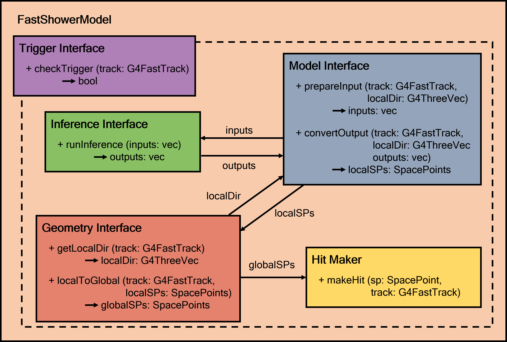
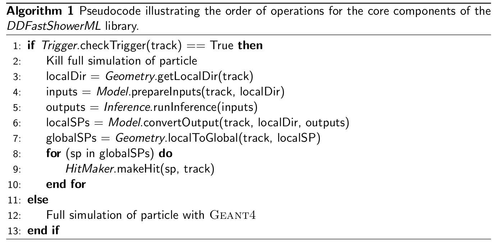

# DDML
[](https://doi.org/10.5281/zenodo.17475368)
[](https://github.com/key4hep/DDML/actions/workflows/key4hep.yml)
[](https://github.com/key4hep/DDML/actions/workflows/pre-commit.yml)
[](https://www.apache.org/licenses/LICENSE-2.0)

Library with utilities and plugins that allow running fast simulation in a Geant4 application using ML inference from within ddsim (DDG4).

### References
1. *Fast Simulation of Highly Granular Calorimeters with
Generative Models: Towards a First Physics Application*, P. McKeown et al., PoS EPS-HEP202 3 (2024) 568, DOI: [10.22323/1.449.0568](https://pos.sissa.it/449/568)

2. *Development and Performance of a Fast Simulation Tool for Showers in High Granularity Calorimeters based on Deep Generative Models*, P.McKeown, DESY-THESIS 186 pp. (2024), DOI: [10.3204/PUBDB-2024-01825](https://bib-pubdb1.desy.de/record/607309)


## Quick start guide

### Environment Setup
Access to `cvmfs` required.

> Comment; 22 probably worked at some point, now in Ubuntu 22 we get 
```
Unsupported OS or OS couldn't be correctly detected, aborting...
Supported OSes are: AlmaLinux/RockyLinux/RHEL 9, Ubuntu 24.04, and Ubuntu 26.04
```

The library can be run in apptainer with an Ubuntu 22.04 docker image as follows, with bind mounting to `cvmfs`:
```
mkdir cvmfs
export APPTAINER_CACHEDIR=<path_to_your_cachedir>
export APPTAINER_TMPDIR=<path_to_your_tmpdir>
apptainer shell --bind /cvmfs:/cvmfs docker://ghcr.io/key4hep/key4hep-images/ubuntu22:latest
```

### Installation

Prerequisites:
- a key4hep release. This will provide:
	- DD4hep, Geant4, podio, EDM4hep, LCIO, ...
- ONNXRuntime
- libTorch.so/dylib

This setup can be achieved with the setup script provided:

```
source setup_env_nightly.sh
```

Now build as usual

```
mkdir build
cd build
#cmake ..
# henry need the flag set to on, otherwise the plugin isn't compiled
cmake -DDDML_ENABLE_EMBEDDED_PYINFERENCE=ON ..
# Henry; works when the run_cc3_pywrapper_ild is commented out of tests/CMakeLists.txt
make -j4 install
```

and ensure to set up the library correctly

```
source ../install/bin/thisDDML.sh
```

### Running the example

The simulation can then be run as usual with ddsim- for example for the ILD detector:

```
# HENRY; apparently we need to explicity add this python path
ddml_python=$(readlink -f ../python)
plugin_python=$(readlink -f ../python/examples)
export PYTHONPATH=${PYTHONPATH}:${ddml_python}:${plugin_python}
cd ../scripts
#ddsim --steeringFile ddsim_steer.py --compactFile $k4geo_DIR/ILD/compact/ILD_l5_o1_v02/ILD_l5_o1_v02.xml
# need to specify the --ml-model CC3_BARREL_PY_INTERFACE and an --inputFile
ddsim --steeringFile ddsim_steer_cc3.py \
 --compactFile $k4geo_DIR/ILD/compact/ILD_l5_o1_v02/ILD_l5_o1_v02.xml \
 --ml-model CC3_BARREL_PY_INTERFACE \
 --inputFile /data/dust/group/ilc/sft-ml/datasets/angular/simulation_inputs/ILD-barrelSmallSegment-singleParticles-gen-E1010pdg22.slcio
```
or for allshowers (must be on a GPU node, and note that multiple instances may cause crashes)
```
ddsim --steeringFile ddsim_steer.py \
 --compactFile $k4geo_DIR/ILD/compact/ILD_l5_o1_v02/ILD_l5_o1_v02.xml \
 --ml-model AS1_BARREL_PY_INTERFACE \
 --inputFile /data/dust/group/ilc/sft-ml/datasets/angular/simulation_inputs/ILD-barrelSmallSegment-singleParticles-gen-E1010pdg22.slcio
```

Depending on the setup in `ddsim_steer.py`, either a `.slcio` file or a `.edm4hep.root` file can be written

Events can be visualised in the standard way for `.slcio` file or a `.edm4hep.root` files, e.g for `.slcio` with ILD:

```
# gets a permission error for the "Gearfile"
ced2go -d $k4geo_DIR/ILD/compact/ILD_l5_o1_v02/ILD_l5_o1_v02.xml dummyOutput.slcio
```

## Structure of the Library

The library has the following key components:

- **Trigger**: Kill the full simulation and run the fast simulation, if conditions are fulfilled
- **Model**: Prepare the model input, and interpret the output
- **Geometry**: Place spacepoints produced by the model (localToGlobal). Also provide local direction of track at calorimeter face
- **Inference**: Calls desired inference library for the model. The library currently supports LibTorch and OnnxRuntime
- **Hit Maker**: Geant4 helper class for placement of energy deposits that land in a sensitive detector region

The structure of the library is summarised in the following class diagram:



And the order of operations is as follows:




## More technical details

For running the example with a given DD4hep detector, there has to be a region
defined in which the fast ML shower simulation will be run.

Depending on the detector of interest, this would involve making a local copy of lcgeo/k4geo (available under `$k4geo_DIR`), and modifying the xml description of the detector element:


```diff
diff --git a/ILD/compact/ILD_common_v02/SEcal06_hybrid_Barrel.xml b/ILD/compact/ILD_common_v02/SEcal06_hybrid_Barrel.xml
index 5ff2e50..084f7ea 100644
--- a/ILD/compact/ILD_common_v02/SEcal06_hybrid_Barrel.xml
+++ b/ILD/compact/ILD_common_v02/SEcal06_hybrid_Barrel.xml
@@ -1,7 +1,14 @@
 <lccdd>
+
+  <regions>
+    <region name="EcalBarrelRegion">
+    </region>
+  </regions>
+
   <detectors>

-    <detector name="EcalBarrel" type="SEcal06_Barrel" id="ILDDetID_ECAL" readout="EcalBarrelCollection" vis="BlueVis" >
+    <detector name="EcalBarrel" type="SEcal06_Barrel" id="ILDDetID_ECAL" readout="EcalBarrelCollection" vis="BlueVis"
+     region="EcalBarrelRegion">

       <comment>EM Calorimeter Barrel</comment>

```

### Python configuration

DDML provides a `ddml` python module for easily adapting a ddsim simulation. The
example `ddsim_steer.py` file is also configured using this. The steering file
imports two helpers and wires them into ddsim in three lines:

```python
from ddml import ddml_physics, get_presets_from_args

presets, record_calo_entry = get_fastsim_configuration()
SIM.physics.setupUserPhysics(ddml_physics(presets, record_calo_entry))
```

One or more named model configurations (defined in `python/ddml/configs.py`) are then
selected on the command line with the `--ml-model` flag:

```
ddsim --steeringFile ddsim_steer.py \
      --compactFile $k4geo_DIR/ILD/compact/ILD_l5_o1_v02/ILD_l5_o1_v02.xml \
      --ml-model CC3_BARREL --ml-model CC3_ENDCAP
```

Repeat `--ml-model` to compose multiple presets (e.g. barrel + endcap).

To add a custom model configuration, instantiate a `ModelConfig` (from
`ddml.model`) with the desired `plugin`, `geometry`, `plugin_properties`, and
trigger settings, and pass it directly to `ddml_physics`:

```python
from ddml import ddml_physics, ModelConfig
from ddml.configs import ILD_BARREL, EM_PARTICLES, EM_TRIGGER_10_GEV

my_model = ModelConfig(
    plugin="MyPlugin/MyModel",
    geometry=ILD_BARREL,
    plugin_properties={"ModelPath": "../models/my_model.pt"},
    applicable_particles=EM_PARTICLES,
    triggers=EM_TRIGGER_10_GEV,
    correct_angles=False,
)
SIM.physics.setupUserPhysics(ddml_physics([my_model]))
```


## Coding style

Coding style is partially enforced. Formatting is done via `clang-format` using
the configuration found in `.clang-format`. Additionally there are minimal
`clang-tidy` checks that enforce that class names are *CamelCase* and that
private and protected member variables have an `m_` prefix and are in
*camelBack* case.
